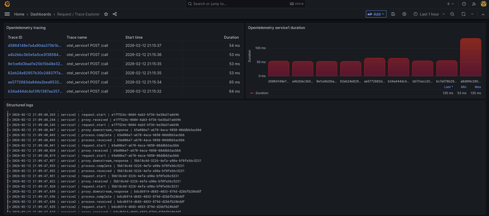
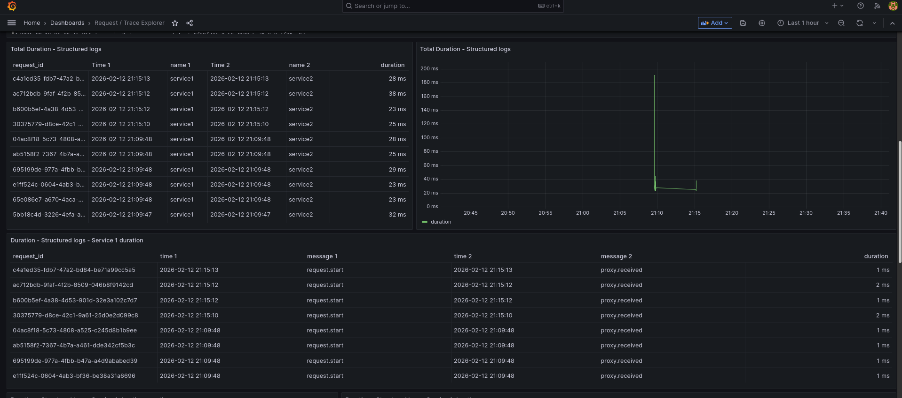
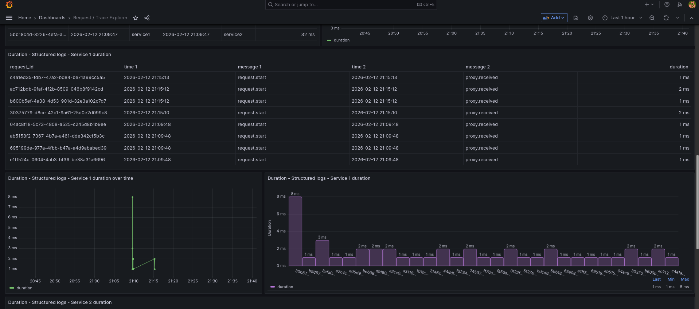
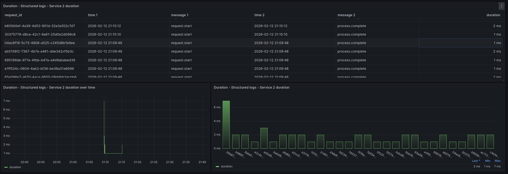
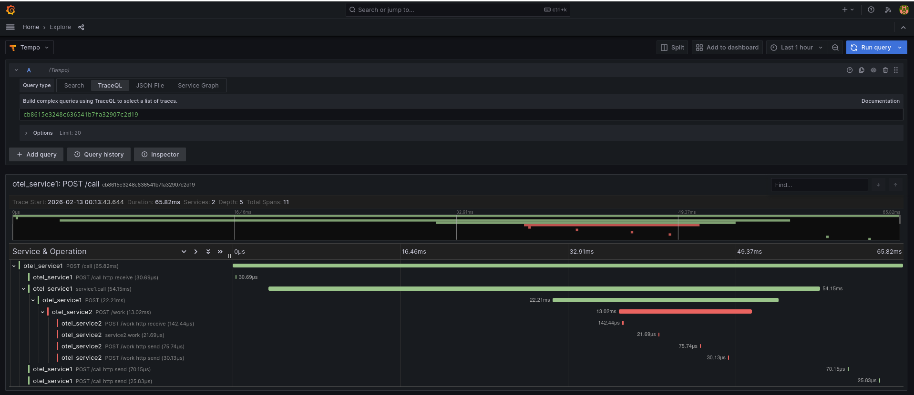

# Distributed Tracing & Logging Demo

A comprehensive demo workspace showcasing distributed tracing and structured logging in microservices architecture. Features two pairs of FastAPI services: one demonstrating request ID propagation with structured JSON logging, and another using OpenTelemetry for distributed tracing with Tempo, Loki, and Grafana observability stack.


## Project Structure

### Core Services (Structured Logging)
- [service1/main.py](service1/main.py) — Proxy service on port 8000, route `/proxy`. Generates or forwards `X-Request-ID` header to service2. Uses middleware for request ID injection and structured logging.
- [service2/main.py](service2/main.py) — Processing service on port 8001, route `/process`. Receives requests with request ID, logs, and returns response.
- [common/logging.py](common/logging.py) — Shared logging configuration with JSON formatting, `ContextVar`-based request ID propagation, and `RequestIdFilter` for automatic request ID injection into all logs (including third-party libraries).

### OpenTelemetry Services (Distributed Tracing)
- [otel_service1/main.py](otel_service1/main.py) — OTel-instrumented service on port 9000, route `/call`. Automatically traces HTTP calls to otel_service2 with FastAPI and httpx instrumentation.
- [otel_service2/main.py](otel_service2/main.py) — OTel-instrumented service on port 9001, route `/work`. Receives traced requests and processes them with custom span creation.

### Configuration & Infrastructure
- [requirements.txt](requirements.txt) — Python dependencies (FastAPI, httpx, OpenTelemetry, python-json-logger).
- [Dockerfile](Dockerfile) — Multi-purpose container image for all services.
- [docker-compose-tempo.yml](docker-compose-tempo.yml) — Full observability stack with Tempo (tracing), Loki (logs), Promtail (log aggregation), Grafana (visualization), and all four services.
- [tempo/tempo.yaml](tempo/tempo.yaml) — Tempo configuration for trace storage and querying.
- [promtail/config.yaml](promtail/config.yaml) — Promtail configuration for Docker container log collection.
- [grafana-tempo/](grafana-tempo/) — Grafana provisioning (datasources + dashboards) for unified logs and traces view.
- [DESIGN.md](DESIGN.md) — Detailed explanation of logging architecture, ContextVar usage, and async-safe request ID propagation.

## Getting Started

### Local Setup

Create and activate a virtual environment:

```bash
python3 -m venv .venv
source .venv/bin/activate  # On Windows: .venv\Scripts\activate
python -m pip install --upgrade pip
pip install -r requirements.txt
```

### Running Services Locally

#### Structured Logging Demo

Start the basic services in separate terminals:

```bash
# Terminal 1: Start service2
source .venv/bin/activate
uvicorn service2.main:app --port 8001

# Terminal 2: Start service1
source .venv/bin/activate
uvicorn service1.main:app --port 8000
```

Test the request ID propagation:

```bash
curl -X POST http://localhost:8000/proxy \
  -H 'Content-Type: application/json' \
  -d '{"name":"Alice"}'
```

**Expected output:** JSON response with echoed data and same `X-Request-ID` in logs from both services.

#### OpenTelemetry Demo

Start the OTel services in separate terminals:

```bash
# Terminal 1: Start otel_service2
source .venv/bin/activate
uvicorn otel_service2.main:app --port 9001

# Terminal 2: Start otel_service1
source .venv/bin/activate
uvicorn otel_service1.main:app --port 9000
```

Test distributed tracing (console exporter):

```bash
curl -X POST http://localhost:9000/call \
  -H 'Content-Type: application/json' \
  -d '{"name":"Tiz"}'
```

**Expected output:** Trace spans printed to console showing request flow across services.

## Key Features

### Request ID Propagation
- **Automatic generation:** Both services generate unique UUIDs when `X-Request-ID` is not provided.
- **Header forwarding:** Service1 forwards the request ID to service2 via HTTP headers.
- **Response headers:** All responses include `X-Request-ID` for client-side correlation.
- **Middleware injection:** FastAPI middleware automatically injects request ID into request state and logging context.

### Structured Logging with ContextVar
- **JSON output:** All logs use structured JSON format with consistent fields.
- **Global propagation:** `ContextVar` ensures request ID appears in logs from all libraries (including httpx, uvicorn).
- **Async-safe:** Works correctly across async/await boundaries without thread-local issues.
- **Filter-based injection:** `RequestIdFilter` automatically adds request ID to every log record at the handler level.

### OpenTelemetry Tracing
- **Automatic instrumentation:** FastAPI and httpx automatically create spans for HTTP operations.
- **Multiple exporters:** Supports console (default), OTLP (Tempo), and Jaeger exporters via environment variables.
- **Distributed context:** Trace context automatically propagates across service boundaries.
- **Custom spans:** Services can add custom spans for specific operations.

## Configuration

### OpenTelemetry Exporter Selection

Control trace export destination via environment variables:

#### Console (Default)
```bash
# No configuration needed - prints spans to stdout
export OTEL_EXPORTER=console
```

#### OTLP (Tempo/Collector)
```bash
export OTEL_EXPORTER=otlp
export OTEL_EXPORTER_OTLP_ENDPOINT=http://localhost:4317
export OTEL_EXPORTER_OTLP_INSECURE=true  # For local development
```

### Service Configuration

Environment variables for service behavior:

- `SERVICE2_URL` — Service1 uses this to locate service2 (default: `http://localhost:8001/process`)
- `OTEL_SERVICE_NAME` — Sets the service name in traces (e.g., `otel_service1`, `otel_service2`)


## Docker Compose Deployment

### Full Observability Stack (Recommended)

The [docker-compose-tempo.yml](docker-compose-tempo.yml) file provides a complete setup with:
- **Tempo** — Distributed tracing backend (OTLP endpoint on ports 4317/4318)
- **Loki** — Log aggregation system (API on port 3100)
- **Promtail** — Log collector for Docker containers
- **Grafana** — Unified visualization dashboard (UI on port 3000)
- All four services (service1, service2, otel_service1, otel_service2)

Start the full stack:

```bash
docker compose -f docker-compose-tempo.yml up --build -d
```

Check service status:

```bash
docker compose -f docker-compose-tempo.yml ps
```

### Exposed Ports

| Service | Port | Description |
|---------|------|-------------|
| Grafana | 3000 | Web UI (admin/admin) |
| Loki | 3100 | Log query API |
| Tempo | 3200 | Trace query API |
| Tempo OTLP | 4317 | gRPC trace ingestion |
| Tempo OTLP HTTP | 4318 | HTTP trace ingestion |
| service1 | 8000 | Structured logging proxy |
| service2 | 8001 | Structured logging processor |
| otel_service1 | 9000 | OTel-instrumented caller |
| otel_service2 | 9001 | OTel-instrumented worker |

### Testing the Stack

Generate traces and logs:

```bash
# Test structured logging services
curl -X POST http://localhost:8000/proxy \
  -H 'Content-Type: application/json' \
  -d '{"name":"Alice"}'

# Test OpenTelemetry services
curl -X POST http://localhost:9000/call \
  -H 'Content-Type: application/json' \
  -d '{"name":"Tiz"}'
```

or run the script:

```bash
# ensure that the file has execution permissions
chmod +x run_calls.sh 

./run_calls.sh [mins]  # mins: duration in minutes (default: 10)
```

Stop and clean up:

```bash
docker compose -f docker-compose-tempo.yml down
# Remove volumes if needed:
docker compose -f docker-compose-tempo.yml down -v
```

## Architecture & Design

### Request Flow: Structured Logging

```
Client → service1:8000/proxy → service2:8001/process
         [X-Request-ID: uuid]   [X-Request-ID: uuid]
         [Middleware injects]   [Middleware injects]
         [JSON logs with ID]    [JSON logs with ID]
```

**Key components:**
- **Middleware:** Generates/extracts request ID, attaches logger to `request.state`
- **ContextVar:** Thread-safe, async-aware request ID storage (`REQUEST_ID`)
- **Filter:** `RequestIdFilter` injects request ID into all log records globally
- **Result:** httpx, uvicorn, and all library logs automatically include request ID

### Request Flow: OpenTelemetry Tracing

```
Client → otel_service1:9000/call → otel_service2:9001/work → Tempo
         [Auto-instrumented]        [Auto-instrumented]     [OTLP]
         [FastAPI span]             [httpx span]            [Storage]
         [Custom spans]             [Custom spans]
```

**Key components:**
- **TracerProvider:** Configured with chosen exporter (console/OTLP/Jaeger)
- **Instrumentation:** `FastAPIInstrumentor` and `HTTPXClientInstrumentor`
- **Context propagation:** W3C Trace Context headers automatically managed
- **Export:** Spans sent to Tempo (or console for local dev)

### Why ContextVar?

The [DESIGN.md](DESIGN.md) file explains in detail why `ContextVar` is used instead of:
- **Thread-local storage** — Doesn't work with async (multiple requests share threads)
- **Global variables** — Race conditions with concurrent requests
- **LoggerAdapter alone** — Third-party libraries bypass custom adapters

`ContextVar` provides async-safe, task-local storage that automatically propagates across `await` boundaries.

## Verification

After starting services, verify functionality:

### Check JSON Logs

All log records should be JSON formatted with consistent `request_id`:

```bash
# Start services and make request
curl -X POST http://localhost:8000/proxy -H 'Content-Type: application/json' -d '{"name":"Test"}'

# Expected output in service1/service2 logs:
# {"asctime": "...", "name": "service1", "message": "proxy.received", "request_id": "<uuid>"}
# {"asctime": "...", "name": "httpx", "message": "HTTP Request: POST ...", "request_id": "<uuid>"}
# {"asctime": "...", "name": "service2", "message": "process.received", "request_id": "<uuid>"}
```

### Check Trace Spans

OTel services should print spans to console (or send to Tempo):

```bash
curl -X POST http://localhost:9000/call -H 'Content-Type: application/json' -d '{"name":"Test"}'

# Expected console output:
# Span with name='POST /call' service='otel_service1' trace_id=... span_id=...
# Span with name='POST http://...:9001/work' service='otel_service1' trace_id=...
# Span with name='POST /work' service='otel_service2' trace_id=... (same trace_id)
```

### Check Grafana

1. Open [http://localhost:3000](http://localhost:3000)
2. Navigate to Explore → Loki
3. Query: `{job="service1"}` — Should show JSON logs
4. Navigate to Explore → Tempo
5. Search for service `otel_service1` — Should show traces
6. Open pre-configured dashboard for unified view

## Troubleshooting

### No logs in Loki
- Check Promtail is running: `docker compose -f docker-compose-tempo.yml ps`
- Verify Promtail config mounts Docker socket: check [promtail/config.yaml](promtail/config.yaml)
- Ensure Docker labels are configured (Promtail uses them to filter containers)

### No traces in Tempo
- Verify OTLP endpoint is reachable: `curl http://localhost:4317`
- Check service environment variables include `OTEL_EXPORTER=otlp`
- Review service logs for OpenTelemetry initialization errors

### Grafana dashboards not loading
- Check provisioning directory is mounted: [grafana-tempo/provisioning/](grafana-tempo/provisioning/)
- Verify dashboard files exist in [grafana-tempo/dashboards/](grafana-tempo/dashboards/)
- Restart Grafana container if provisioning was changed after start

## Additional Resources

- **[DESIGN.md](DESIGN.md)** — Detailed explanation of logging architecture and ContextVar usage
- **OpenTelemetry Docs** — https://opentelemetry.io/docs/
- **Grafana Tempo Docs** — https://grafana.com/docs/tempo/
- **Loki LogQL** — https://grafana.com/docs/loki/latest/logql/

## License

This is a demonstration project for educational purposes.

## Grafana Observability

Access Grafana at [http://localhost:3000](http://localhost:3000) after starting the Docker Compose stack.

**Default credentials:** `admin` / `admin` (change on first login)

### Pre-configured Features

1. **Datasources** (auto-provisioned):
   - **Tempo** — Distributed tracing from OpenTelemetry services
   - **Loki** — Container logs from all services via Promtail

2. **Dashboards** (auto-provisioned):
   - Located in [grafana-tempo/dashboards/](grafana-tempo/dashboards/)
   - Request trace correlation dashboard showing logs + traces

### Querying Logs (Loki)

Use LogQL in Grafana Explore to search logs:

```logql
# All logs from service1
{job="service1"}

# Logs containing a specific request ID
{job="service1"} |= "request_id" |= "a7deee1a-f6b6-4d0f-ac2e-750cbe210364"

# Logs with trace ID for correlation
{job="otel_service1"} | json | trace_id!=""
```

### Querying Traces (Tempo)

Search traces by:
- Service name (e.g., `otel_service1`, `otel_service2`)
- Trace ID
- Duration ranges
- Custom span attributes


## Dashboard screenshots





